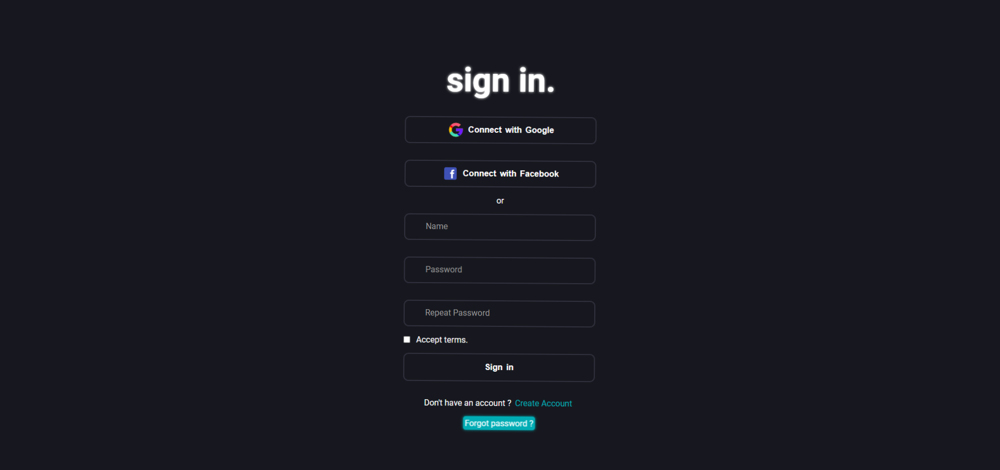

# Form made to show my front-end skills

## I used javascript events and localstorage to save data.

* First look at the form above: 

I've created some animations with css together with javascript and used javascript to save data in localstorage. 

> NOTE: I saved the password in localstorage just to show this knowledge, I know that saving a password in localstorage is not the best practice of security